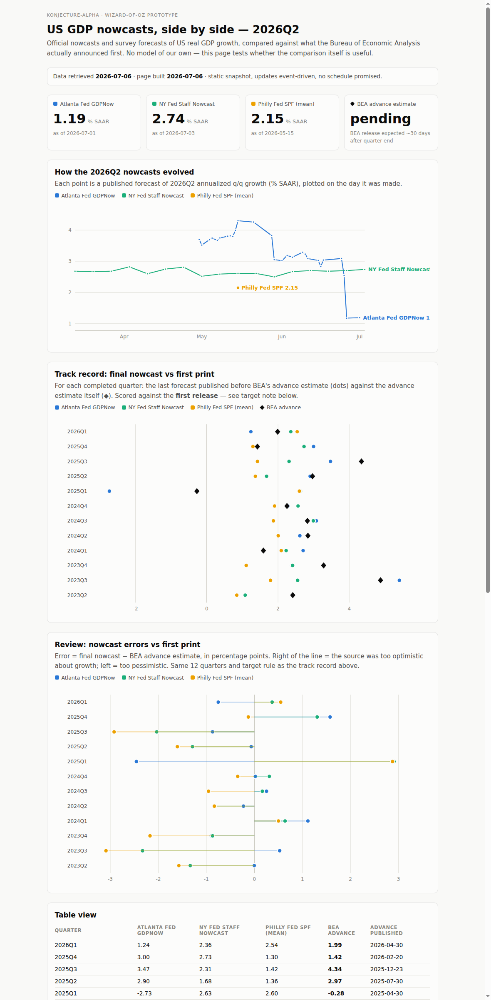
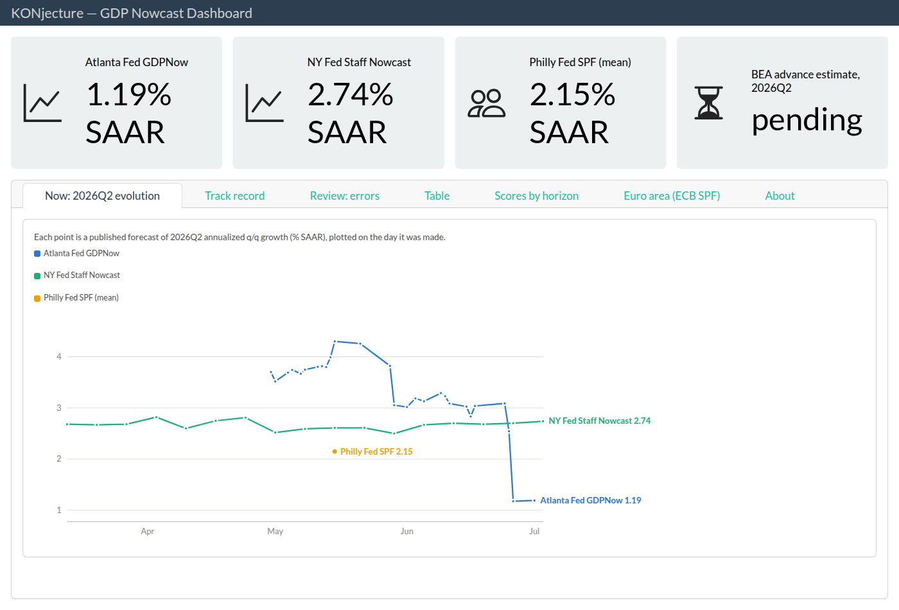

# KONjecture-alpha — a linear walkthrough

*Generated by [`build.sh`](build.sh) — do not edit by hand. Every code block below is
extracted verbatim from the repository by `sed` (the exact command is printed under each
snippet). Screenshots are captured from the committed static pages by
[`screenshots.sh`](screenshots.sh).*

This document retells the project so far in the order it actually happened:
vision → market research → one deliberate decision → schema → data → pages →
models → a language port → tests → dashboard.

---

## 1 · What this is

An open-source platform (vision stage, [Issue #1](https://github.com/hzmchen/KONjecture-alpha/issues/1))
for serving, comparing, and evaluating real-time GDP nowcasts across regions. Two premises
set the decision lens for everything below ([research/00](../research/00-methodology-and-rubrics.md)):

- **P-A — Liebhaberei.** A one-person side project; success = sustained enjoyment and
  learning. The project must tolerate dormancy: artifacts announce their own staleness,
  and nothing requires standing infrastructure.
- **P-B — AI-assisted build.** Writing code is cheap; *maintainer attention* (validation,
  operations, obligations) is the scarce resource. Build-vs-reuse tilts toward thin
  bespoke glue over heavy dependencies; *standards* (hubverse formats) are still adopted.

## 2 · Market research (2026-06-10)

Nine research docs ([research/](../research/)) covered supply, demand, synthesis, delivery
risks, vintage reconstruction, a survivorship-bias sweep of dead comparable projects, and a
pre-mortem. A component catalog ([research/components/](../research/components/README.md))
then verified every intended building block. Its headline findings:

````text
1. **The full intended stack exists, is currently maintained, and is license-compatible.** Every "Adopt" block from R3 checked out as alive in June 2026: `dfms` 1.0.0, `midasr` 0.9, `scoringutils` 2.2.0, `targets` 1.12.0, `crew` 1.3.1, `shiny` 1.13.0, hubverse 13-package suite (all MIT). No load-bearing component is archived, orphaned, or pre-1.0 except where flagged.
2. **TODO N5 (webR/WASM audit) is effectively answered — positively.** Of 32 stack packages checked against `repo.r-wasm.org`, **31 have pre-built WASM binaries — including C++-based `dfms`, `midasr`, `scoringutils`, `duckdb`, and `nanoparquet`. The only miss is `arrow`**, which is fully substitutable browser-side by `nanoparquet`/`duckdb`. The shinylive default deployment ([05 §3](../05-shiny-risks-and-alternatives.md)) is viable. Details: [06-view-layer-delivery §3](06-view-layer-delivery.md).
3. **The graveyard predicted the right failure mode: this layer's rot vector is provider-API churn and single-maintainer decay, concentrated in *data clients* and *niche estimation* packages.** Newly verified CRAN removals: `nowcastDFM` (2022, same `matlab` dependency death as `nowcasting`), `mfbvar` (2022, "issues were not corrected in time" — the mixed-frequency BVAR model class is now unowned in R), `wiesbaden` (2025, maintainer request). Successors exist (`restatis` for Destatis, `bbk` for Bundesbank/ECB) — the catalog tracks both.
4. **The hubverse is mostly off-CRAN.** Only `hubUtils` and `hubEnsembles` are on CRAN; `hubData`, `hubValidations`, `hubEvals`, `hubAdmin`, `hubVis` install from the hubverse r-universe. Consequence for a dormancy-tolerant project: pin via `renv` lockfile with the r-universe repo URL, or vendor — and prefer *formats over code* exactly as [03 §5](../03-synthesis-market-gap-and-fit.md) recommends.
5. **Two licensing notes, neither blocking:** `rdbnomics` is AGPL-3 (copyleft reaches code that imports it — fine for an open project, or call the DBnomics HTTP API directly); GPL-3 estimation cores (`dfms`, `fable`) mean a combined distributed work should carry a GPL-compatible license.
````
<sub>verbatim from [`research/components/README.md`](../research/components/README.md) — `sed -n '/^1\. \*\*The full intended stack/,/^5\./p' research/components/README.md`</sub>

The prioritized outcome was five "Now" items in [TODO.md](../TODO.md): **N1** decide the
evaluation target measure, **N2** a riskiest-assumption pipeline spike, **N3** a
Wizard-of-Oz comparison page, **N4** seed the archive retroactively, **N5** a webR/WASM
audit (already done during research: 31/32 stack packages have WASM binaries).

## 3 · The one real decision: what does "right" mean? (N1, Issue #2)

GDP is revised for years, so "the nowcast was right" is ill-posed until you name the
target. Critical review ([research/09](../research/09-target-measure-decision.md)) found
the schema question was already self-resolved — store *every* outcome vintage and any
target rule is computable later — which narrowed N1 to defaults. The owner confirmed
option 4 of the issue:

````text
| Role | Target | Rationale |
|------|--------|-----------|
| **Headline (user-facing)** | First publication (advance/flash) | Matches user expectation ("what will be announced"), GDPNow TrackRecord precedent [06 §2], available ~30 days after quarter end |
| **Scientific (leaderboard)** | Fixed-horizon vintage (value as published *k* quarters after the reference quarter) | Stable, reproducible, standard in the real-time literature; avoids the moving-target problem of "latest vintage" |
| **Not a default** | Latest available vintage | Scores silently change as revisions arrive — hostile to a dormancy-tolerant project whose published artifacts must stay self-consistent while unattended ([08 F3](08-pre-mortem.md)) |
````
<sub>verbatim from [`research/09-target-measure-decision.md`](../research/09-target-measure-decision.md) — `sed -n '/^| Role |/,/dormancy-tolerant/p' research/09-target-measure-decision.md`</sub>

Residual sub-decisions (D1 per-region "first release", D2 the fixed-horizon k, D3 units,
D4 dual-ranking presentation) were parked exactly where they gate work.

## 4 · Schema: scores are (forecast, target-rule) pairs

[docs/schema.md](../docs/schema.md) encodes the decision: outcome rows carry their own
publication vintage; canonical units are non-annualized q/q growth with SAAR as a display
transform; and target rules are named, never implied:

````markdown
## Target rules (scores are computed against a named rule, never "the truth")

| Rule id | Definition | Status |
|---|---|---|
| `first_release` | earliest `release_label` per region — **D1 decided**: US = BEA `advance`; EA = Eurostat preliminary flash (proxied by the first ECB-RTD vintage, disclosed) | headline default (N1) |
| `fixed_h8` | vintage published 8 quarters after `target_period` — **D2 decided**: k = 8 (2y, literature convention), k = 12 as sensitivity | scientific default; EA computable now, US awaits ALFRED (O3) |
| `latest` | max `published_on` | computable, never a default (09 §2) |

## Horizon buckets (scores are stratified, never pooled across horizons)

Owner requirement (recorded with the D1/D2 sign-off, [09 §5](../research/09-target-measure-decision.md)):
nowcast performance and longer-term forecast performance are different questions. Every score
carries a `horizon` bucket derived from `quarters_ahead` = (target quarter start − forecast-date
quarter start) / 3 months:

| Bucket | `quarters_ahead` | Reading |
|---|---|---|
| `backcast` | < 0 | made after the target quarter ended, before first release |
| `nowcast` | 0 | made inside the target quarter |
| `1q_ahead` | 1 | one quarter out |
| `2-4q_ahead` | 2–4 | up to a year out (SPF/ECB SPF territory) |
| `5q+_ahead` | ≥ 5 | long-horizon (ECB SPF 2y rolling targets) |

Aggregates (MAE, bias, RMSE) are reported per (source, region, target rule, bucket); cross-region
aggregation stays forbidden (09 §4).

Append-only discipline: ingestion may add rows, never mutate or delete; re-downloads that change history are a new `retrieved_at` generation, flagged loudly.
````
<sub>verbatim from [`docs/schema.md`](../docs/schema.md) — `sed -n '/^## Target rules/,/^Append-only/p' docs/schema.md`</sub>

## 5 · Seeding the archive (N4)

Two strictly separated stages ([ingest/](../ingest/README.md)). The **network stage** is a
deliberate manual act — one polite GET per source into an append-only cache with SHA-256
provenance, never a build side effect. One entry of the source register:

````r
  gdpnow = list(
    url = "https://www.atlantafed.org/-/media/Project/Atlanta/FRBA/Documents/cqer/researchcq/gdpnow/GDPTrackingModelDataAndForecasts.xlsx",
    file = "gdpnow_tracking.xlsx",
    notes = "Atlanta Fed GDPNow: TrackingDeepArchives / TrackingArchives / TrackRecord tabs; TrackRecord includes BEA advance estimates (outcome vintage 'advance')."
  ),
````
<sub>verbatim from [`ingest/download_raw.R`](../ingest/download_raw.R) — `sed -n '/^  gdpnow = list(/,/^  ),$/p' ingest/download_raw.R`</sub>

The **transform stage** normalizes the cache into `data/archive/` (3,285 forecasts from
GDPNow 2011→ daily incl. the live quarter, NY Fed 2022→ weekly, Philly SPF 1968→, ECB SPF
1999→; 59 vintage-dated BEA advance outcomes). The canonical unit conversion is one line:

````r
saar_to_qq <- function(s) ((1 + s / 100)^0.25 - 1) * 100
````
<sub>verbatim from [`ingest/build_archive.R`](../ingest/build_archive.R) — `sed -n '/^saar_to_qq/p' ingest/build_archive.R`</sub>

Validation attention earned its keep immediately: the first ECB parser leaked unemployment
rows (~6.5%) into GDP means because the next section header says "EXPECTED", not
"EXPECTATIONS" — a spot check (individuals ~0.8–1.3 ⇒ mean must be ≈1, not 3.4) caught it.
The fixed boundary detection:

````r
    # section headers = prose rows (letters, not TARGET_PERIOD); data rows start
    # with a target period like "2026", "2026Q4", "2027Mar"
    is_hdr <- grepl("[A-Za-z]", col0) & col0 != "TARGET_PERIOD" &
      !grepl("^\\d{4}(Q[1-4]|[A-Z][a-z]{2})?$", col0)
    hdr_idx <- which(is_hdr)
    gdp_start <- hdr_idx[grepl(GDP_HDR, col0[hdr_idx], fixed = TRUE)]
    if (!length(gdp_start)) return(NULL)
    start <- gdp_start[1]
    later <- hdr_idx[hdr_idx > start]
    end <- if (length(later)) later[1] else length(lines) + 1L
````
<sub>verbatim from [`ingest/build_archive.R`](../ingest/build_archive.R) — `sed -n '/# section headers = prose rows/,/end <- if/p' ingest/build_archive.R`</sub>

## 6 · The Wizard-of-Oz comparison page (N3)

Before building any model: is the *comparison itself* useful? A static, self-contained
page (no server, no external assets) generated from the archive answers that with real
data — including GDPNow's 3.70 → 1.19 slide over the 2026Q2 cycle:



Two design requirements came straight from the pre-mortem and the target-measure decision.
Self-announcing staleness (08 F3) — the page carries a dormant-mode banner that activates
itself after 45 days:

````js
  var built = new Date('$BUILT_AT');
  var days = (Date.now() - built.getTime()) / 864e5;
  if (days > 45) document.getElementById('stale').style.display = 'block';
````
<sub>verbatim from [`site/template.html`](../site/template.html) — `sed -n '/var built = new Date/,/display = .block./p' site/template.html`</sub>

And a target disclosure (09 D4): every score on the page names the first release as its
target. One R-specific bug from this stage is preserved as a regression test — `gsub`
interprets `&` in replacements even with `fixed=TRUE`, which would corrupt every `&amp;`:

````r
# split/join instead of gsub: replacement text contains "&", which gsub would
# reinterpret as "the whole match" even under fixed=TRUE
replace_all <- function(x, pat, rep) {
  parts <- strsplit(x, pat, fixed = TRUE)[[1]]
  if (endsWith(x, pat)) parts <- c(parts, "")
  paste(parts, collapse = rep)
}
````
<sub>verbatim from [`site/R/site_lib.R`](../site/R/site_lib.R) — `sed -n '/# split\/join instead of gsub/,/^}/p' site/R/site_lib.R`</sub>

## 7 · The riskiest-assumption spike (N2)

Can one person run data → benchmark + factor model → probabilistic output → append-only
archive, reproducibly, with zero standing infrastructure? The `targets` pipeline says yes:
one full run builds everything, a second run skips all targets. The two models, honest and
minimal — an AR(2) benchmark and a DFM bridge on `dfms` (the R3-"adopt" estimation core):

````r
ar_benchmark <- function(gdp, target_q) {
  y <- gdp$gdp_saar
  n <- length(y)
  fit <- lm(y[3:n] ~ y[2:(n - 1)] + y[1:(n - 2)])
  sigma <- summary(fit)$sigma
  b <- coef(fit)
  point <- unname(b[1] + b[2] * y[n] + b[3] * y[n - 1])
  list(model_id = "konjecture_ar2", target = target_q, point = point,
       q = point + qnorm(QUANTILES) * sigma)
}
````
<sub>verbatim from [`pipeline/R/functions.R`](../pipeline/R/functions.R) — `sed -n '/^ar_benchmark <- function/,/^}/p' pipeline/R/functions.R`</sub>


````r
dfm_bridge <- function(X, gdp, target_q, r = 2, p = 2) {
  xm <- as.matrix(X[, -1])
  rownames(xm) <- as.character(X$date)
  m <- dfms::DFM(xm, r = r, p = p)
  f <- data.frame(quarter = month_quarter(X$date), f1 = m$F_qml[, 1])
  fq <- aggregate(f1 ~ quarter, f, mean)

  dat <- merge(gdp[, c("quarter", "gdp_saar")], fq, by = "quarter")
  dat <- dat[order(dat$quarter), ]
  n <- nrow(dat)
  fit <- lm(dat$gdp_saar[2:n] ~ dat$f1[2:n] + dat$gdp_saar[1:(n - 1)])
  sigma <- summary(fit)$sigma
  b <- coef(fit)
  f_target <- fq$f1[fq$quarter == target_q]  # mean over the months available so far
  point <- unname(b[1] + b[2] * f_target + b[3] * dat$gdp_saar[n])
  list(model_id = "konjecture_dfm_bridge", target = target_q, point = point,
       q = point + qnorm(QUANTILES) * sigma)
}
````
<sub>verbatim from [`pipeline/R/functions.R`](../pipeline/R/functions.R) — `sed -n '/^dfm_bridge <- function/,/^}/p' pipeline/R/functions.R`</sub>

Output is hubverse-style (point + 7 quantiles, `declared_target = "advance"`), appended
with keyed dedupe. For 2026Q2 the spike produced AR(2) 2.82 vs DFM bridge 3.25 %SAAR —
model *quality* is explicitly out of scope until scoring (X2) exists.

## 8 · The pure-R port

The first implementation was Python (only runtime available on day one) + R (models).
Assessment: one runtime is strategically better under P-A/P-B, and the port risk was
retired empirically — `readxl` even reads the Philly xlsx that crashed Python's openpyxl.
Method: freeze the Python outputs as golden files, port, and diff. Result: archive
row-for-row identical except **one cell** (an exact survey mean of 2.92225, where R's
half-even rounding gives the correct 2.9222); the generated page byte-identical. The
whole build now hangs off one dependency graph:

````r
# Single entry point for the whole build: raw cache -> normalized archive ->
# nowcast models -> static site. Run from pipeline/:  Rscript -e 'targets::tar_make()'
# The network stage (ingest/download_raw.R) stays a separate, deliberate manual
# step — the pipeline itself never touches the network. See pipeline/README.md.
library(targets)
tar_source("R")  # functions.R + scoring.R
tar_option_set(packages = c("dfms", "nanoparquet", "data.table"))

list(
  # --- raw cache (files tracked, never fetched here) ---
  tar_target(raw_gdpnow, "../data/raw/gdpnow_tracking.xlsx", format = "file"),
  tar_target(raw_nyfed, "../data/raw/nyfed_staff_nowcast.xlsx", format = "file"),
  tar_target(raw_philly, "../data/raw/spf_philly_meangrowth.xlsx", format = "file"),
  tar_target(raw_ecb, "../data/raw/spf_ecb_individual.zip", format = "file"),
  tar_target(raw_manifest, "../data/raw/manifest.json", format = "file"),
  tar_target(monthly_file, "../data/raw/fred_monthly_indicators.csv", format = "file"),
  tar_target(gdp_file, "../data/raw/fred_gdp_growth.csv", format = "file"),

  # --- N4: normalized vintage-correct archive (ingest/build_archive.R) ---
  tar_target(archive_script, "../ingest/build_archive.R", format = "file"),
  tar_target(archive_files,
             run_build_script(archive_script,
                              c(raw_gdpnow, raw_nyfed, raw_philly, raw_ecb, raw_manifest),
                              c("../data/archive/forecasts.parquet",
                                "../data/archive/outcomes.parquet",
                                "../data/archive/forecasts.csv",
                                "../data/archive/outcomes.csv")),
             format = "file"),

  # --- N2: nowcast models (latest-vintage FRED inputs) ---
  tar_target(monthly_raw, read_monthly(monthly_file)),
  tar_target(gdp, read_gdp(gdp_file)),
  tar_target(X, transform_monthly(monthly_raw)),
  tar_target(target_q, nowcast_quarter(gdp, X)),
  tar_target(fc_ar, ar_benchmark(gdp, target_q)),
  tar_target(fc_dfm, dfm_bridge(X, gdp, target_q)),
  tar_target(run_date, as.character(Sys.Date())),
  tar_target(model_output, rbind(as_model_output(fc_ar, run_date),
                                 as_model_output(fc_dfm, run_date))),
  tar_target(archived, append_model_output(model_output,
                                           "../data/archive/model_output.parquet"),
             format = "file"),

  # --- N3: static comparison page (site/build_site.R) ---
  tar_target(site_script, "../site/build_site.R", format = "file"),
  tar_target(site_lib, "../site/R/site_lib.R", format = "file"),
  tar_target(site_template, "../site/template.html", format = "file"),
  tar_target(site_html,
             run_build_script(site_script, c(archive_files, site_lib, site_template, scores_files),
                              "../site/index.html"),
             format = "file"),

  # --- X2: scoring vs named target rules, stratified by horizon bucket ---
  tar_target(fc_archive, {
    invisible(archive_files)
    as.data.table(nanoparquet::read_parquet("../data/archive/forecasts.parquet"))
  }),
  tar_target(oc_archive, {
    invisible(archive_files)
    as.data.table(nanoparquet::read_parquet("../data/archive/outcomes.parquet"))
  }),
  tar_target(scores, score_first_release(fc_archive, oc_archive)),
  tar_target(scores_agg, score_summary(scores)),
  tar_target(scores_files, write_scores(scores, scores_agg, "../data/archive"),
             format = "file"),

  # --- X5 (Quarto fallback): static dashboard, only when the quarto CLI exists ---
  tar_target(dashboard_qmd, "../site/dashboard.qmd", format = "file"),
  tar_target(dashboard_html,
             render_dashboard(dashboard_qmd, c(archive_files, site_lib, scores_files),
                              "../site/dashboard.html"),
             format = "file")
)
````
<sub>verbatim from [`pipeline/_targets.R`](../pipeline/_targets.R) — `sed -n '1,$p' pipeline/_targets.R`</sub>

## 9 · Tests and coverage

121 offline `testthat` tests (`Rscript tests/run_tests.R`); the committed raw cache is the
fixture set, writes go only to tempdirs, and download paths are exercised via `file://`
URLs and a refused localhost connection — never a real provider. Both ECB parser traps are
pinned forever:

````r
test_that("spf_ecb section parsing survives its two known traps", {
  ecb <- spf_ecb()
  expect_identical(nrow(ecb), 627L)
  # trap 1: unemployment rows leaking through a bad section boundary (was 3.39)
  spot <- ecb[forecast_date == as.Date("2026-04-15") & target_period == "2026"]
  expect_equal(spot$value_native, 0.9556)
  # trap 2: the half-even rounding cell (exact mean 2.92225 -> 2.9222)
  cell <- ecb[forecast_date == as.Date("2000-07-15") & target_period == "2002"]
  expect_equal(cell$value_native, 2.9222)
  expect_true(all(ecb$unit_native == "yoy_pct"))
})
````
<sub>verbatim from [`tests/testthat/test-archive.R`](../tests/testthat/test-archive.R) — `sed -n '/two known traps/,/^})/p' tests/testthat/test-archive.R`</sub>

Coverage (`Rscript tests/coverage.R`, `covr`):

````text
| File | Line coverage |
|---|---|
| `ingest/build_archive.R` | 96.7% |
| `ingest/download_raw.R` | 92.1% |
| `pipeline/R/functions.R` | 100.0% |
| `pipeline/R/scoring.R` | 100.0% |
| `site/R/site_lib.R` | 99.5% |
| **Total** | **98.1%** |
````
<sub>verbatim from [`tests/COVERAGE.md`](../tests/COVERAGE.md) — `sed -n '/^| File |/,/\*\*Total\*\*/p' tests/COVERAGE.md`</sub>

## 10 · The Quarto dashboard (X5 fallback)

A static dashboard (`quarto render site/dashboard.qmd`, self-contained HTML) that adds
*layout only* — value boxes, tabs, staleness banner — around the same tested chart
library the N3 page uses, so both views agree by construction:



A value box is a few lines of qmd delegating to `site_lib.R`:

````markdown
#| content: valuebox
#| title: "Atlanta Fed GDPNow"
x <- last_of("gdpnow")
list(icon = "graph-up", color = "light",
     value = sprintf("%.2f%% SAAR", x$value_native))
```
````
<sub>verbatim from [`site/dashboard.qmd`](../site/dashboard.qmd) — `sed -n '/#| content: valuebox/,/^```$/{p; /^```$/q;}' site/dashboard.qmd`</sub>

In the pipeline it is a soft dependency — `tar_make()` stays runnable from R alone:

````r
render_dashboard <- function(qmd, deps, output) {
  invisible(deps)
  if (Sys.which("quarto") == "") {
    message("quarto CLI not found - skipping dashboard render (site/dashboard.html unchanged)")
    return(output)
  }
  system2("quarto", c("render", qmd), stdout = TRUE, stderr = TRUE)
  stopifnot(file.exists(output))
  output
}
````
<sub>verbatim from [`pipeline/R/functions.R`](../pipeline/R/functions.R) — `sed -n '/^render_dashboard <- function/,/^}/p' pipeline/R/functions.R`</sub>

## 11 · Where it stands

All five Now-items are done; the commit trail below is the project's actual linear
history. Open gates: **D1+D2** (per-region first-release definition, fixed-horizon k)
unlock scoring (X2); **ALFRED vintages** need a free API key; owner-side: merge the two
branches, close Issue #2.

````text
71762ff Add research methodology, rubrics, and repo README
9146778 Add supply-side research: landscape, coverage scores, gaps
a598d86 Add demand-side research: segments, requirements, selling points
945ad50 Add synthesis and high-level summary
fc7e02b Revise analysis for Liebhaberei + AI-assisted-build premises (v2)
8748cfa Add Shiny-risk analysis, vintage-reconstruction study, and TODO
9784ec9 Add graveyard sweep (07) and pre-mortem (08); correct OECD Tracker status
fe81bce Add component catalog (research/components/) for Issue #3; N5 WASM audit done
f5fe3e9 Narrow N1 (target measure): adopt option-4 working assumption, add decision analysis (research/09)
ddc38b1 Record owner confirmation of Issue #2 option 4 — N1 decided
0dfdd1d N4 prep: archive schema v0.1 (outcome-as-of-vintage, target rules, hubverse mapping)
062e0d0 N4a: one-off raw downloads (GDPNow, NY Fed, Philly SPF, ECB SPF) + provenance manifest
220caf1 N4b: normalized vintage-correct archive from 4 sources (3,258 forecasts, 59 advance outcomes)
35e7f8c N3: static Wizard-of-Oz comparison page (site/) generated from the archive
311a92c N2: riskiest-assumption spike PASSED — targets+dfms pipeline, end-to-end reproducible
6f4f32f Pure-R port: ingest + site generation rewritten in R, validated against golden outputs
db7cb8d Pure R complete: unify archive+site into targets graph, drop Python, add renv lockfile
8ab1653 Tests + coverage: 117 offline testthat tests, 97.8% line coverage
259a81c X5 (Quarto fallback): static dashboard from the tested chart library
76dda9e Add walkthrough/: generated linear project history with verbatim code + screenshots
c1cf380 TODO: record owner-only actions (O1-O4: PR merge, Issue #2 close, ALFRED key, D1/D2 sign-off)
5ef850f X1: review mode — error chart (final nowcast vs first print) on page + dashboard
3a98726 N4 residuals: EA outcome vintages (ECB RTD) + NY Fed legacy file ingested
41fb2d1 X9: pre-mortem countermeasures — fail-loud CI, license registry, sunset + escrow skeletons
85f5e59 Finalize goal round: coverage 98.1% (134 tests), walkthrough + screenshots refreshed
ed91e48 Record D1+D2 decisions (owner sign-off) + horizon-bucket stratification requirement
a20f247 X2: scoring module — vintage-correct scores vs first_release, horizon-stratified
````
<sub>generated at build time — `git log --reverse --format='%h %s'`</sub>
